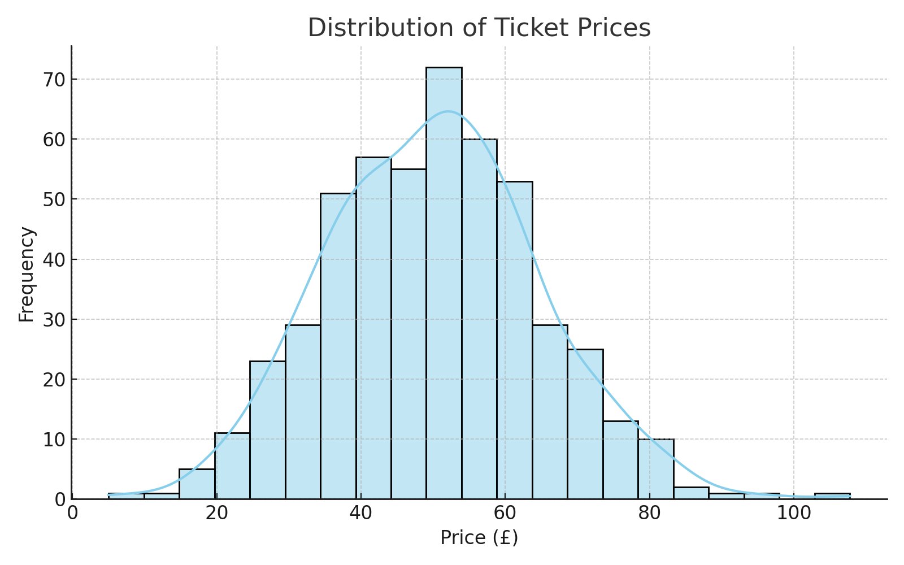
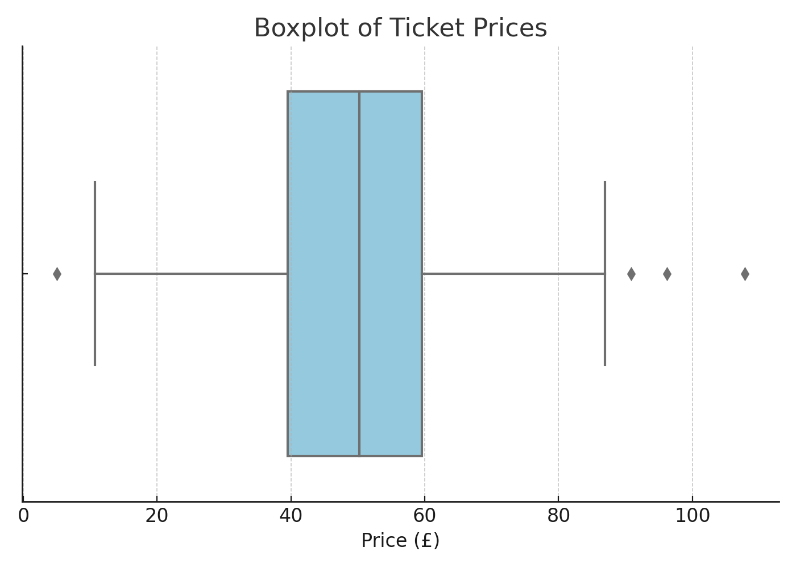
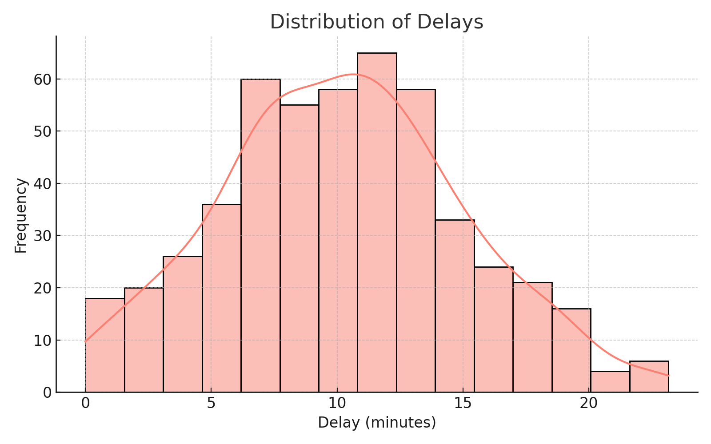
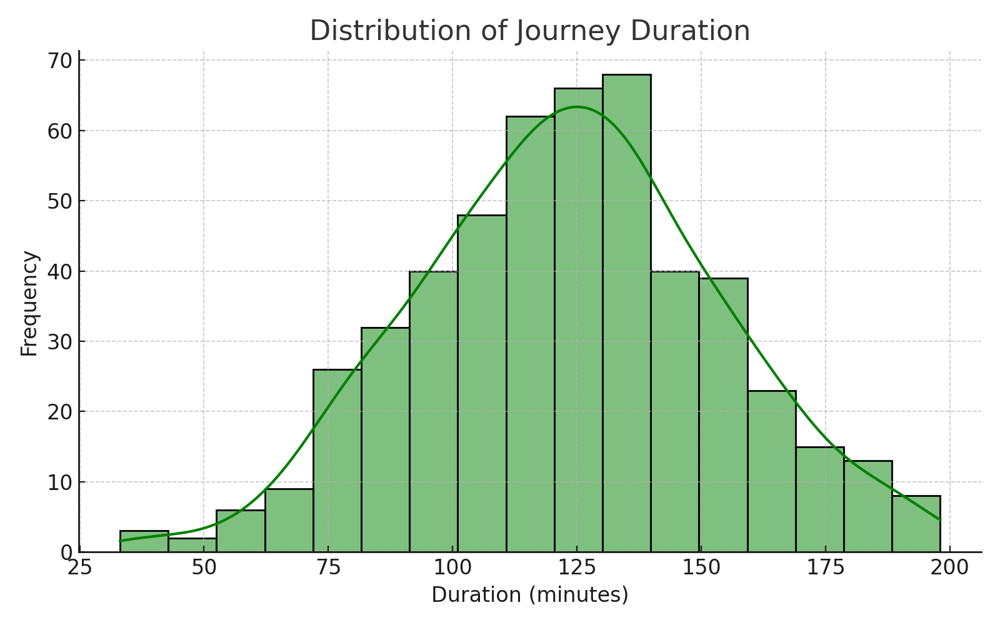
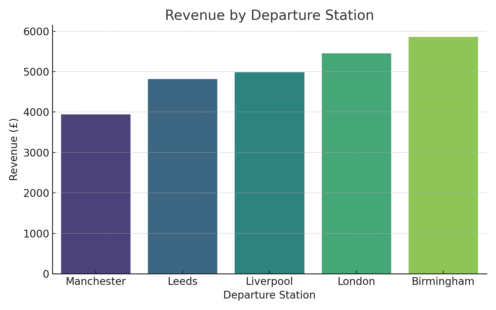
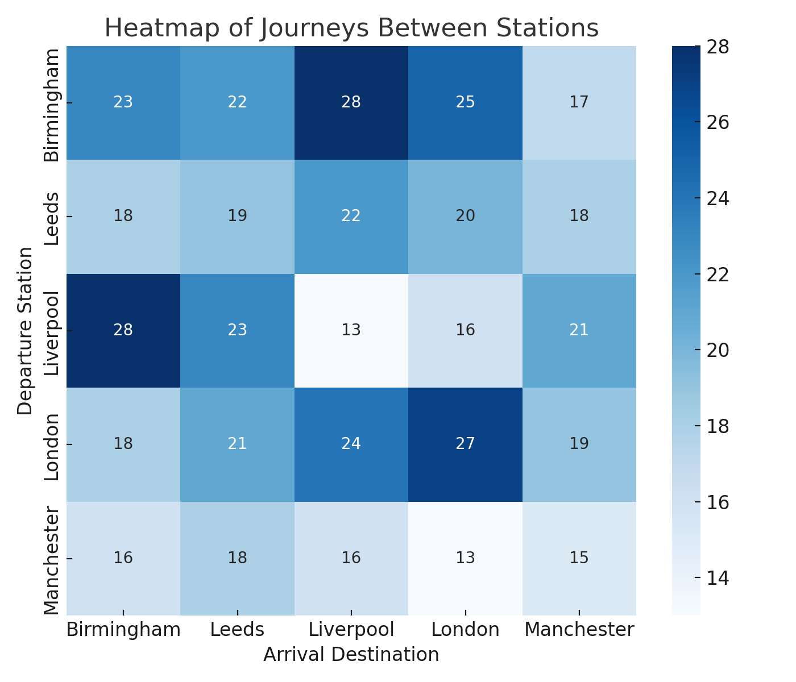
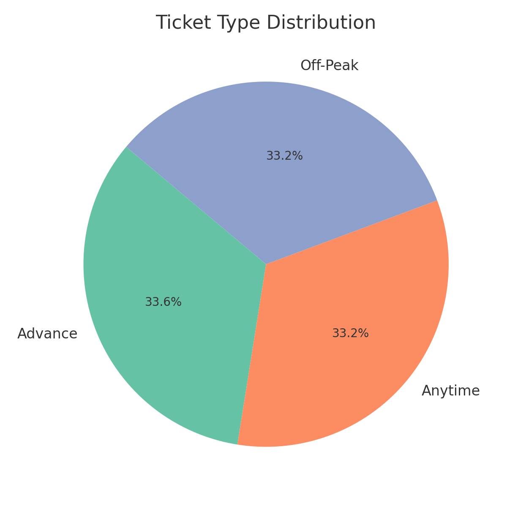
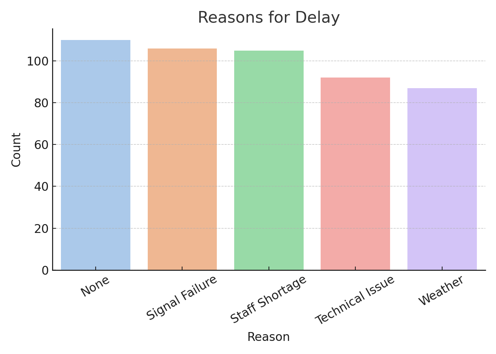
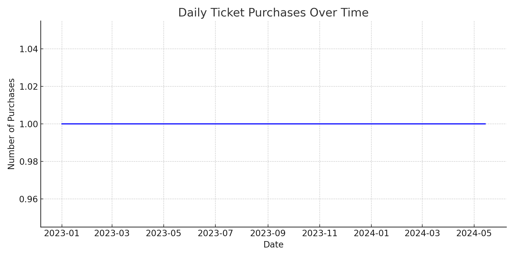

# Railways UK Data Analysis

## 📖 Overview
This project presents a **comprehensive data analysis** of the UK Railways dataset.  
It includes **data cleaning, preprocessing, exploratory data analysis (EDA), KPI development, deep insights, and customer segmentation**.  
The objective is to extract meaningful insights about **ticket prices, delays, revenue distribution, travel patterns, and customer behavior**.

---

## 🛠️ Tools & Libraries
The analysis was carried out using **Python** with the following libraries:
- **pandas, numpy** → Data manipulation and statistical operations  
- **matplotlib, seaborn** → Data visualization and exploration  
- **ydata-profiling** → Automated exploratory profiling  
- **scikit-learn** → Machine learning for regression and clustering  

---

## 📂 Project Structure
```
├── railwaysukipynb.py    # Main analysis script
├── railway.csv           # Dataset (not included in repo, add separately)
├── images/               # Visualizations used in README
├── README.md             # Project documentation
├── requirements.txt      # Dependencies
```

---

## 📸 Visualizations

### 1. Distribution Analysis
Understanding the distribution of prices, delays, and journey durations.

- **Ticket Price Distribution**  
  

- **Boxplot of Ticket Prices (Outliers)**  
  

- **Delay Distribution**  
  

- **Journey Duration Distribution**  
  

---

### 2. Revenue Analysis
Evaluating revenue by departure stations.

- **Revenue by Departure Station**  
  

---

### 3. Route Analysis
Studying traffic between stations.

- **Heatmap of Routes Between Stations**  
  

---

### 4. Ticket & Delay Analysis
Exploring ticket type proportions and reasons for delays.

- **Ticket Type Distribution**  
  

- **Reasons for Delay**  
  

---

### 5. Temporal Trends
Studying purchase activity across time.

- **Daily Ticket Purchases Trend**  
  

---

## 👩‍💻 Author
**Remah Ramadan** – Data Analyst  

Email: remahramadan10@gmail.com  
LinkedIn: [Remah Ramadan](https://bit.ly/4lDIiPy)  
Kaggle: [Remah Ramadan](http://bit.ly/4n1XjMI)  
